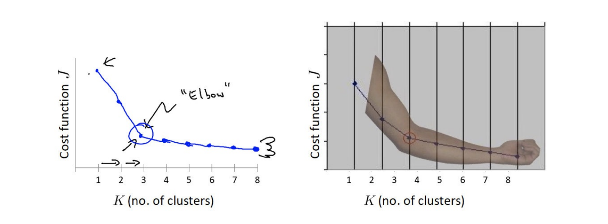
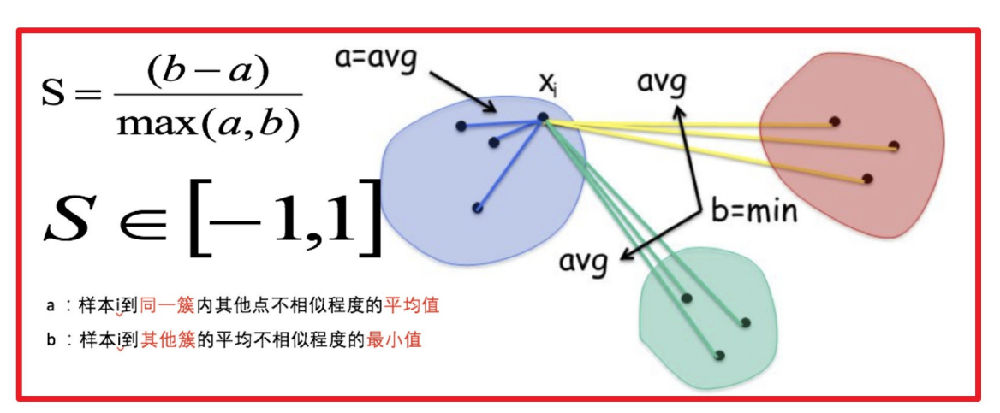

# K-means 

## 应用场景 

- ⽤户画像，⼴告推荐，Data Segmentation，搜索引擎的流量推荐，恶意流量识别
- 基于位置信息的商业推送，新闻聚类，筛选排序
- 图像分割，降维，识别；离群点检测；信⽤卡异常消费；发掘相同功能的基因⽚段

**聚类算法**：

⼀种典型的⽆监督学习算法，主要⽤于将相似的样本⾃动归到⼀个类别中。

在聚类算法中根据样本之间的相似性，将样本划分到不同的类别中，对于不同的相似度计算⽅法，会得到不同的聚类结果，常⽤的相似度计算⽅法有欧式距离法。

**api介绍**
sklearn.cluster.KMeans(n_clusters=8)
- 参数:
    - n_clusters:开始的聚类中⼼数量
        - 整型，缺省值=8，⽣成的聚类数，即产⽣的质⼼（centroids）数。
- ⽅法:
    - estimator.fit(x)
    - estimator.predict(x)
    - estimator.fit_predict(x)
        - 计算聚类中⼼并预测每个样本属于哪个类别,相当于先调⽤fit(x),然后再调⽤predict(x)

## 聚类算法实现流程 

流程：

- 1、随机设置K个特征空间内的点作为初始的聚类中⼼
- 2、对于其他每个点计算到K个中⼼的距离，未知的点选择最近的⼀个聚类中⼼点作为标记类别
- 3、接着对着标记的聚类中⼼之后，重新计算出每个聚类的新中⼼点（平均值）
- 4、如果计算得出的新中⼼点与原中⼼点⼀样（质⼼不再移动），那么结束，否则重新进⾏第⼆步过程

## 模型评估

### 误差平方和 

$$
SSE = \sum_{i=1}^k \sum_{p \epsilon C_i} \mid p-m_i \mid ^2
$$

### “肘”⽅法 (Elbow method) — K值确定

（1）对于n个点的数据集，迭代计算k from 1 to n，每次聚类完成后计算每个点到其所属的簇中⼼的距离的平⽅和；

（2）平⽅和是会逐渐变⼩的，直到k==n时平⽅和为0，因为每个点都是它所在的簇中⼼本身。

（3）在这个平⽅和变化过程中，会出现⼀个拐点也即“肘”点，下降率突然变缓时即认为是最佳的k值。

在决定什么时候停⽌训练时，肘形判据同样有效，数据通常有更多的噪⾳，在增加分类⽆法带来更多回报时，我们停⽌增加类别。

### 轮廓系数法（Silhouette Coefficient）

结合了聚类的凝聚度（Cohesion）和分离度（Separation），⽤于评估聚类的效果

⽬的：

内部距离最⼩化，外部距离最⼤化

$$
s(i) = \frac{b(i) - a(i)}{\max(a(i), b(i))}
$$ 
$$
s(i)=  \begin{cases}
    1 - \frac{a(i)}{b(i)} & , & a(i)<b(i) \\
    0 &,& a(i)=b(i) \\ 
    \frac{b(i)}{a(i)} -1 &,& a(i)>b(i) \\
\end{cases}
$$
计算样本i到同簇其他样本的平均距离$a_i$，$a_i$ 越⼩样本i的簇内不相似度越⼩，说明样本i越应该被聚类到该簇。

计算样本$i$到最近簇$C_j$ 的所有样本的平均距离$b_{ij}$，称样本i与最近簇$C_j$ 的不相似度，定义为样本$i$的簇间不相似度：$b_i=min{b_{i1}, b_{i2}, ..., b_{ik}}$，$b_i$越⼤，说明样本i越不属于其他簇。

求出所有样本的轮廓系数后再求平均值就得到了平均轮廓系数。

平均轮廓系数的取值范围为[-1,1]，系数越⼤，聚类效果越好。

簇内样本的距离越近，簇间样本距离越远

### CH系数（Calinski-Harabasz Index）

Calinski-Harabasz：

类别内部数据的协⽅差越⼩越好，类别之间的协⽅差越⼤越好（换句话说：类别内部数据的距离平⽅和越⼩越好，类别之间的距离平⽅和越⼤越好），这样的Calinski-Harabasz分数s会⾼，分数s⾼则聚类效果越好。
$$
s(k) = \frac{tr(B_k)}{tr(W_k)} \frac{m-k}{k-1}
$$
tr为矩阵的迹, B 为类别之间的协⽅差矩阵，W 为类别内部数据的协⽅差矩阵;m为训练集样本数，k为类别数。
$$
\begin{pmatrix}
    a_{11} & a_{12} & \cdots & a_{1n} \\
    a_{21} & a_{22} & \cdots & a_{21n} \\
    \vdots & \vdots & \ddots & \vdots \\
    a_{n1} & a_{n2} & \cdots & a_{nn} \\
\end{pmatrix}
$$
迹定义：$a_{11} + a_{22} + ... + a_{nn}$

使⽤矩阵的迹进⾏求解的理解：

矩阵的对⻆线可以表示⼀个物体的相似性

在机器学习⾥，主要为了获取数据的特征值，那么就是说，在任何⼀个矩阵计算出来之后，都可以简单化，只要获取矩阵的迹，就可以表示这⼀块数据的最重要的特征了，这样就可以把很多⽆关紧要的数据删除掉，达到简化数据，提⾼处理速度。

CH需要达到的⽬的：

⽤尽量少的类别聚类尽量多的样本，同时获得较好的聚类效果。

