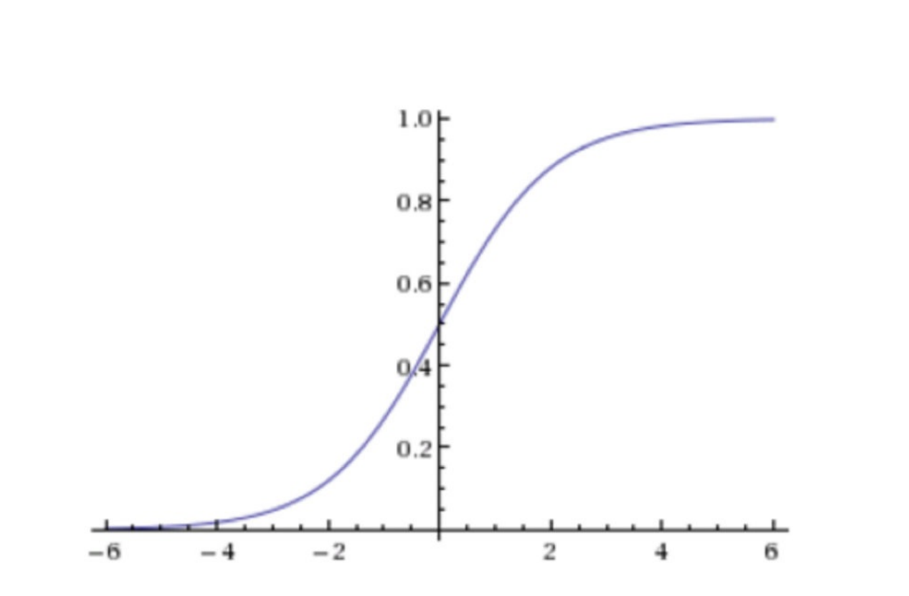
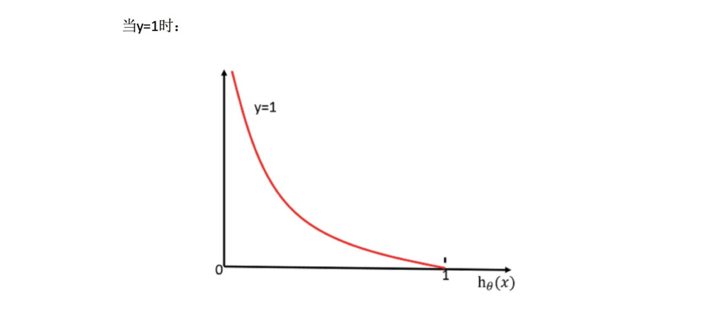

# 逻辑回归的应⽤场景
    - ⼴告点击率
    - 是否为垃圾邮件
    - 是否患病
    - ⾦融诈骗
    - 虚假账号

#  逻辑回归的原理

## 输入

$$
h(x) = w_1x_1+w_2x_2+w_3x_3+...+b
$$

## 激活函数
- sigmoid函数

$$
g(w^T,x)=\frac{1}{1+e^{-h(x)}}=\frac{1}{1+e^{-w^Tx}}
$$

- 判断标准
    - 回归的结果输⼊到sigmoid函数当中
    - 输出结果：[0, 1]区间中的⼀个概率值，默认为0.5为阈值

**注意：逻辑回归的阈值是可以进⾏改变的**

$$
\begin{aligned}
  g^{'}(x) &= (\frac{1}{1+e^{-x}})^{'} \\
        &= \frac{e^{-x}}{(1+e^{-x})^2} \\
        &= \frac{1}{1+e^{-x}} \frac{e^{-x}}{1+e^{-x}} \\
        &= \frac{1}{1+e^{-x}} (1-\frac{1}{1+e^{-x}}) \\
        &= g(x)(1-g(x))
\end{aligned}
$$

## 损失以及优化

### 损失

逻辑回归使用的是交叉熵损失函数:

设$y_i=1$的概率为$p_i$,则$y_i=0$概率为$1-p_i$，那么观测概率为：
$$
p(y_i) = p_{i}^{y_i} * (1 - p_{i})^{1-y_i}
$$
可以得到极大似然函数：
$$
\prod_{i=1}^n h_\theta(x^{(i)})^{y_i} * (1 - h_\theta(x^{(i)}))^{1-y_i}
$$
取对数之后：
$$
J(\theta) = -\frac{1}{m}
\begin{bmatrix}
\sum_{i=1}^m ( y^{(i)} log(h_\theta(x^{(i)})) + (1-y^{(i)})log(1-h_\theta(x^{(i)})))
\end{bmatrix}
$$

另一种理解，逻辑回归的损失，称之为对数似然损失，公式如下：

$$
cost(h_\theta(x),y)=\begin{cases}
-log(h_\theta(x)) & if \ \  y=1 \\ 
\\
-log(1-h_\theta(x)) & if \ \  y=0
\end{cases}
$$
> 其中y为真实值，h (x)为预测值

分情况讨论，对应的损失函数值：
   - 当y=1时，我们希望h (x)值越⼤越好；
   - 当y=0时，我们希望h (x)值越⼩越好;
   - 综合完整损失函数

$$
cost(h_\theta(x),y)=\sum_{i=1}^m - y_i log(h_\theta(x)) - (1-y_i) log(1-h_\theta(x))
$$

### 优化 

同样使⽤梯度下降优化算法，去减少损失函数的值。这样去更新逻辑回归前⾯对应算法的权重参数，提升原本属于1类别的概率，降低原本是0类别的概率。

$$
\begin{aligned}
\frac{\partial}{\partial\theta_j}J(\theta) &= \frac{\partial}{\partial\theta_j} \begin{bmatrix}-\frac{1}{m}
\begin{bmatrix}
\sum_{i=1}^m ( y^{(i)} log(h_\theta(x^{(i)})) + (1-y^{(i)})log(1-h_\theta(x^{(i)})))
\end{bmatrix}
\end{bmatrix}
\end{aligned}
$$

