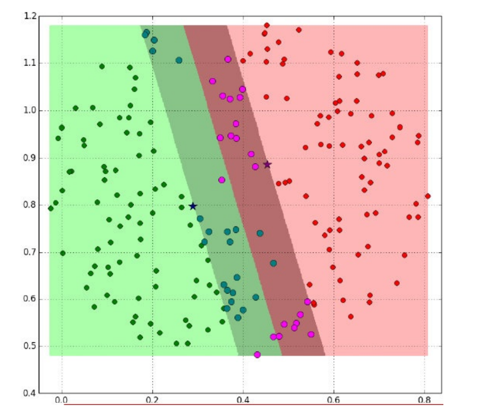

# SVM
- - - 

核心：如果找到一条线（或者平面等）让样本点区分的越开越远越好

假设给定⼀个特征空间上的训练集为：
$$
(x_1,y_1),(x_2,y_2),(x_3,y_3)...(x_n,y_n) \ \ \ \  x_i \epsilon R^n , y_i \epsilon \{-1,1\}, i = 1,2,...,n
$$

y 为 x 的标记：
- 当 x 为正例时，y = 1   
- 当 x 为负例时，y = -1

- - - 
## 线性可分SVM

给定了上⾯提出的线性可分训练数据集，通过间隔最⼤化得到分离超平⾯为 :
$$
y(x) = w^T \phi(x) + b 
$$ 

相应的分类决策函数为： 
$$
f(x) = sign(w^T \phi(x) + b )
$$
以上决策函数就称为线性可分⽀持向量机。

这⾥解释⼀下$\phi(x)$:
这是某个确定的特征空间转换函数，它的作⽤是将x映射到更⾼的维度，它有⼀个以后我们经常会⻅到的专有称号"核函数"。

> ⽐如我们看到的特征有2个： 
> $x_1, x_2$组成最先⻅到的线性函数可以是 $w_1x_1 + w_2 x_2$ 
> 但也许这两个特征并不能很好地描述数据，于是我们进⾏维度的转化，变成了
> $$w_1x_1 + w_2 x_2+ w_3 x_1 x_2 + w_4 x^2 + w_5 x^2 $$
> 于是我们多了三个特征。⽽这个就是笼统地描述$x$的映射的。
>最简单直接的就是：$\phi(x) = x$

**其实也就是我们要去求⼀组参数$(w,b)$,使其构建的超平⾯函数能够最优地分离两个集合。**
如下就是⼀个最优超平⾯：

- - - 
## 推导目标函数
超平面表达式：$y(x) = w^T \phi(x) + b$

为了⽅便我们让：$\phi(x) = x$

则在样本空间中，划分超平⾯可通过如下线性⽅程来描述：$w^T \phi(x) + b = 0$ 

- 法向量$w = (w_1,w_2,...,w_n)$决定了超平面的方向
- 位移项$b$，决定了超平面和原点之间的距离
- 显然，划分超平⾯可被法向量$w$和位移$b$确定，我们把其记为$(w,b)$

样本空间中任意点$x$到超平⾯$(w,b)$的距离可写成
$$
\gamma=\frac{|w^T \phi(x) + b|}{||w||}
$$

假设超平⾯$(w,b)$能将训练样本正确分类，即对于$(x , y ) ∈ D$，
- 若$y = +1$，则有$w^T \phi(x) + b > 0$;
- 若$y = −1$，则有$w^T \phi(x) + b < 0$;

令

$$
\begin{cases}
    w^T \phi(x) + b \ge +1 \ ,\  y_i = +1\\
    w^T \phi(x) + b \le -1 \ ,\  y_i = -1\\
\end{cases}
$$

如图所示，距离超平⾯最近的⼏个训练样本点使上式等号成⽴，他们被称为“⽀持向量"，两个异类⽀持向量到超平⾯的距离之和为:
$$
\gamma=\frac{2}{||w||}
$$
它被称为“间隔”。如下图所示：

欲找到具有最⼤间隔的划分超平⾯，也就是要找到能满⾜下式中约束的参数$w$和$b$，使得$γ$最⼤。
$$
\begin{cases}
    w^T \phi(x) + b \ge +1 \ ,\  y_i = +1\\
    w^T \phi(x) + b \le -1 \ ,\  y_i = -1\\
\end{cases}
$$
即
$$
\max_{w,b} = \frac{2}{||w||} \\
s.t. \ \ \ y_i(w^T \phi(x) + b) \ge 1, \ \ i=1,2,...,m
$$

显然，为了最⼤化间隔，仅需要最⼤化$||w||^{-1}$ ，这等价于最⼩化$||w||^2$ 。于是上式可以重写为：
$$
\min_{w,b} = \frac{1}{2} ||w||^2\\
s.t. \ \ \ y_i(w^T \phi(x) + b) \ge 1 \ \  or \ \  1 - y_i(w^T \phi(x) + b)\le 0 \ \  , \ \ i=1,2,...,m
$$

- - -
## ⽬标函数的求解 
### 拉格朗⽇乘⼦法

经过朗格朗⽇乘⼦法，我们可以把⽬标函数转换为：
$$
L(w,b,\alpha) = \frac{1}{2} ||w||^2 - \sum_{i=1}^n\alpha_{i}(y_i(w^T \phi(x) + b)-1)
$$
其中，要想求得极⼩值，上式后半部分:
$$
- \sum_{i=1}^n\alpha_{i}(y_i(w^T \phi(x) + b)-1) = 0
$$
### 对偶问题 
$$
\min_{w,b}\max_{\alpha} L(w,b,\alpha) \ge \max_{\alpha} \min_{w,b} L(w,b,\alpha)
$$ 
即最大值中的最小值大于等于最小值中的最大值 

⾸先我们对原⽬标函数的w和b分别求导：
  
- 对$w$求偏导：
$$
\frac{\partial L}{\partial w} = 0\ \  \Rightarrow \ \  w=\sum_{i=1}^n \alpha_{i} y_i \phi(x_n)
$$

- 对$b$求偏导：
  
$$
\frac{\partial L}{\partial b} = 0\ \  \Rightarrow \ \  0=\sum_{i=1}^n \alpha_{i} y_i
$$

然后将以上w和b的求导函数重新代⼊原⽬标函数的w和b中，得到的就是原函数的对偶函数：
$$
\begin{aligned}
    L(w,b,\alpha) =& \frac{1}{2} ||w||^2 - \sum_{i=1}^n\alpha_{i}(y_i(w^T \phi(x) + b)-1) \\
    =& \frac{1}{2}w^Tw - w^T \sum_{i=1}^n \alpha_{i} y_i \phi(x_i) - b \sum_{i=1}^n \alpha_{i} y_i + \sum_{i=1}^n \alpha_{i} \\
    =& \frac{1}{2}w^T\sum_{i=1}^n \alpha_{i} y_i \phi(x_n) - w^T \sum_{i=1}^n \alpha_{i} y_i \phi(x_i) - b\cdot 0 + \sum_{i=1}^n \alpha_{i} \\
    =& \sum_{i=1}^n \alpha_{i} - \frac{1}{2}\left(\sum_{i=1}^n \alpha_{i} y_i \phi(x_i)\right)^T \sum_{i=1}^n \alpha_{i} y_i \phi(x_i) \\
    =& \sum_{i=1}^n \alpha_{i} - \frac{1}{2} \sum_{i=1}^n \sum_{i=j}^n \alpha_{i} \alpha_{j} y_i y_j \phi^T(x_i) \phi(x_j)
\end{aligned}
$$

这个对偶函数其实求的是： 
$$
\max_{\alpha} \min_{w,b} L(w,b,\alpha)
$$
中的
$$ 
\min_{w,b} L(w,b)
$$
部分（因为对w,b求了偏导）。
于是现在要求的是这个函数的极⼤值$max(\alpha)$,写成公式就是：
$$
\alpha^{*} = \argmax_{\alpha}\left( \sum_{i=1}^n \alpha_{i} - \frac{1}{2} \sum_{i=1}^n \sum_{j=1}^n \alpha_{i} \alpha_{j} y_i y_j \phi^T(x_i) \phi(x_j)   \right) \\
s.t.\ \ \ \  \sum_{i=1}^n \alpha_{i} y_i = 0,\ \ \  \alpha_{i} \ge 0
$$

现在只需要对上式求出极⼤值$α$，然后将$α$代⼊$w$求偏导的那个公式：
$$
\frac{\partial L}{\partial w} = 0\ \  \Rightarrow \ \  w=\sum_{i=1}^n \alpha_{i} y_i \phi(x_n)
$$
从⽽求出$w$。将$w$代⼊超平⾯的表达式，计算$b$值；现在的$w,b$就是我们要寻找的最优超平⾯的参数。

- - -
## 流程总结

我们⽤数学表达式来说明上⾯的过程：

1. ⾸先是求$\min_{w,b} L(w,b)$的极⼤值。即：
$$
 \max_{\alpha} \sum_{i=1}^n \alpha_{i} - \frac{1}{2} \sum_{i=1}^n \sum_{j=1}^n \alpha_{i} \alpha_{j} y_i y_j \phi^T(x_i) \phi(x_j)   \\
s.t.\ \ \ \  \sum_{i=1}^n \alpha_{i} y_i = 0,\ \ \  \alpha_{i} \ge 0
$$

2. 对⽬标函数添加符号，转换成求极⼩值：
$$
 \min_{\alpha} \frac{1}{2} \sum_{i=1}^n \sum_{j=1}^n \alpha_{i} \alpha_{j} y_i y_j \phi^T(x_i) \phi(x_j) -\sum_{i=1}^n \alpha_{i}   \\
s.t.\ \ \ \  \sum_{i=1}^n \alpha_{i} y_i = 0,\ \ \  \alpha_{i} \ge 0
$$

3. 计算上⾯式⼦的极值求出$α^*$ ;
4. 将$α^*$ 代⼊，计算$w,b$
   $$
   w=\sum_{i=1}^n \alpha^{*}_{i} y_i \phi(x_i) \\
   b= y_i - \sum_{i=1}^n \sum_{j=1}^n \alpha^{*}_{i} y_i (\phi(x_i) \phi(x_j))
   $$
5. 求得超平⾯：
   $$w^*\phi(x)+b^*=0 $$
6. 求得分类决策函数：
   $$f(x) = sign(w^*\phi(x)+b^*) $$

- - -
## 软间隔SVM

引入松弛因子：$y_i(wx_i+b) \ge 1- \xi_{i}$ 
目标函数：
$$
\min = \frac{1}{2} ||w||^2 + C \cdot \sum_{i=1}^n\xi_{i}
$$

- 当C趋于无穷大时，意味着分类严格不能有错误
- 当C趋于很小时，意味着分类可以容忍更大的错误

目标函数：
$$
L(w,b,\xi,a,\mu) = \frac{1}{2} ||w||^2 + C \cdot \sum_{i=1}^n\xi_{i} - \sum_{i=1}^n\alpha_{i}(y_i(w^T \phi(x) + b)-1+\xi_i)-\sum_{i=1}^n \mu_i \xi_i \\
s.t. \ \ \  w=\sum_{i=1}^n \alpha_{i} y_i \phi(x_i) \\
\sum_{i=1}^n \alpha_{i} y_i = 0 \\
C - \alpha_i - \mu_i= 0 
$$

带入原式：
$$
 \max_{\alpha} \sum_{i=1}^n \alpha_{i} - \frac{1}{2} \sum_{i=1}^n \sum_{j=1}^n \alpha_{i} \alpha_{j} y_i y_j \phi^T(x_i) \phi(x_j)   \\
s.t.\ \ \ \  \sum_{i=1}^n \alpha_{i} y_i = 0\\
\alpha_{i} \ge 0 \\
C - \alpha_i - \mu_i= 0  \\
\mu_i \ge 0\\
0\le \alpha_{i} \le C
$$

$\Longrightarrow$ 

$$
\min_{\alpha} \frac{1}{2} \sum_{i=1}^n \sum_{j=1}^n \alpha_{i} \alpha_{j} y_i y_j \phi^T(x_i) \phi(x_j) -\sum_{i=1}^n \alpha_{i}   \\
s.t.\ \ \ \  \sum_{i=1}^n \alpha_{i} y_i = 0 \\
  \alpha_{i} \ge 0\\
  0\le \alpha_{i} \le C
$$

- - - 
## SVM的损失函数 

在SVM中，我们主要讨论三种损失函数：

 

- 绿⾊：0/1损失
    - 当正例的点落在$y=0$这个超平⾯的下边，说明是分类正确，⽆论距离超平⾯所远多近，误差都是0.
    - 当这个正例的样本点落在$y=0$的上⽅的时候，说明分类错误，⽆论距离多远多近，误差都为1.
    - 图像就是上图绿⾊线。
  
- 蓝⾊：SVM Hinge损失函数
    - 当⼀个正例的点落在$y=1$的直线上，距离超平⾯⻓度1，那么$1-\xi=1$，$\xi=0$，也就是说误差为0；
    - 当它落在距离超平⾯0.5的地⽅，$1-\xi=0.5$，$\xi=0.5$，也就是说误差为0.5；
    - 当它落在$y=0$上的时候，距离为0，$1-\xi$=0，$\xi=1$，误差为1；
    - 当这个点落在了$y=0$的上⽅，被误分到了负例中，距离算出来应该是负的，⽐如-0.5，那么$1-\xi=-0.5，\xi=-1.5$.误差为1.5.
    - 以此类推，画在⼆维坐标上就是上图中蓝⾊那根线了。
  
- 红⾊：Logistic损失函数
    - 损失函数的公式为：$ln(1 + e )$
    - 当$y = 0$时，损失等于$ln2$,这样真丑，所以我们给这个损失函数除以$ln2$.
    - 这样到$y = 0$时，损失为1，即损失函数过（0，1）点
    - 即上图中的红⾊线。

- - - 
## 核函数 

核函数，是将原始输⼊空间映射到新的特征空间，从⽽，使得原本线性不可分的样本可能在核空间可分。

假设$X$是输⼊空间，$H$是特征空间，存在⼀个映射$\phi$使得$X$中的点$x$能够计算得到$H$空间中的点$h$，对于所有的$X$中的点都成⽴：
$$ h=\phi(x)$$

若$x，z$是$X$空间中的点，函数$\kappa(x,z)$满⾜下述条件，那么都成⽴，则称$\kappa$为核函数，⽽$\phi$为映射函数：
$$k(x,z)=\phi(x)\phi(z)$$

### 举例 
$$
 \phi:R^2 \rightarrow R^3 \\
 (x_1,x_2) \rightarrow (z_1,z_2,z_3)= (x_{1}^2,\sqrt{2}x_1x_2,x_{2}^2) \\ 
$$

$$
\begin{aligned}
 \langle \phi(x_1,x_2)\phi(x^{'}_{1},x^{'}_{2}) \rangle = 
 \langle (z_1,z_2,z_3)(z^{'}_1,z^{'}_2,z^{'}_3) \rangle = 
 \langle (x_{1}^2,\sqrt{2}x_1x_2,x_{2}^2)(x_{1}^{'2},\sqrt{2}x^{'}_1x^{'}_2,x_{2}^{'2}) \rangle = \\x_{1}^2 x_{1}^{'2} + 2x_1x_2x^{'}_{1}x^{'}_{2}) + x_{2}^2x_{2}^{'2} = (x_{1} x_{1}^{'} + x_{2} x_{2}^{'})^2= (\langle x,x^{'} \rangle)^2 = \kappa(x,x^{'})
\end{aligned} 
$$

经过上⾯公式，具体变换过过程为：
$$
x = (x_1,x_2, x_3) = (1, 2, 3) \\
y = (y_1,y_2, y_3) = (4, 5, 6)\\
f(x) = (x_1x_1, x_1x_2, x_1x_3, x_2x_1, x_2x_2, x_2x_3, x_3x_1, x_3x_2, x_3x_3)\\
f(x) = (1, 2, 3, 2, 4, 6, 3, 6, 9)\\
f(y) = (16, 20, 24, 20, 25, 36, 24, 30, 36)\\
\langle f(x), f(y) \rangle= 16 + 40 + 72 + 40 + 100 + 180 + 72 + 180 + 324 = 1024\\
\kappa(x, y) = (< x, y >) =\langle f(x), f(y) \rangle= (4 + 10 + 18) = 32 = 1024
$$

## 常见核函数 
|名称|表达式|参数|
|:--|:--|:--|
线性核|$\kappa(x_i,x_j) = x_{i}^Tx_j$| |
多项式核|$\kappa(x_i,x_j) = (x_{i}^Tx_j)^d$| $d\ge1$ 为多项式次数 |
高斯(RBF)核|$\kappa(x_i,x_j) = exp(-\frac{\parallel x_i-x_j \parallel^2}{2\sigma^2})$| $\sigma > 0$|
拉普拉斯核|$\kappa(x_i,x_j) = exp(-\frac{\parallel x_i-x_j \parallel}{\sigma})$|$\sigma > 0$ |
Sigmod核|$\kappa(x_i,x_j) = tanh(\beta x_{i}^Tx_j + \theta)$| tanh 为双曲正切线函数，$\beta >0,\theta<0$| 

线性核和多项式核：
- 这两种核的作⽤也是⾸先在属性空间中找到⼀些点，把这些点当做base，核函数的作⽤就是找与该点距离和⻆度满⾜某种关系的样本点。
- 当样本点与该点的夹⻆近乎垂直时，两个样本的欧式⻓度必须⾮常⻓才能保证满⾜线性核函数⼤于0；⽽当样本点与base点的⽅向相同时，⻓度就不必很⻓；⽽当⽅向相反时，核函数值就是负的，被判为反类。即，它在空间上划分出⼀个梭形，按照梭形来进⾏正反类划分。
  

RBF核：
- ⾼斯核函数就是在属性空间中找到⼀些点，这些点可以是也可以不是样本点，把这些点当做base，以这些base为圆⼼向外扩展，扩展半径即为带宽，即可划分数据。
- 换句话说，在属性空间中找到⼀些超圆，⽤这些超圆来判定正反类。

Sigmoid核：
- 同样地是定义⼀些base，核函数就是将线性核函数经过⼀个tanh函数进⾏处理，把值域限制在了-1到1上。

总之，都是在定义距离，⼤于该距离，判为正，⼩于该距离，判为负。⾄于选择哪⼀种核函数，要根据具体的样本分布情况来确定。

⼀般有如下指导规则：
- 1） 如果Feature的数量很⼤，甚⾄和样本数量差不多时，往往线性可分，这时选⽤LR或者线性核Linear；
- 2） 如果Feature的数量很⼩，样本数量正常，不算多也不算少，这时选⽤RBF核；
- 3） 如果Feature的数量很⼩，⽽样本的数量很⼤，这时⼿动添加⼀些Feature，使得线性可分，然后选⽤LR或者线性核Linear；
- 4） 多项式核⼀般很少使⽤，效率不⾼，结果也不优于RBF；
- 5） Linear核参数少，速度快；RBF核参数多，分类结果⾮常依赖于参数，需要交叉验证或⽹格搜索最佳参数，⽐较耗时；
- 6）应⽤最⼴的应该就是RBF核，⽆论是⼩样本还是⼤样本，⾼维还是低维等情况，RBF核函数均适⽤。
