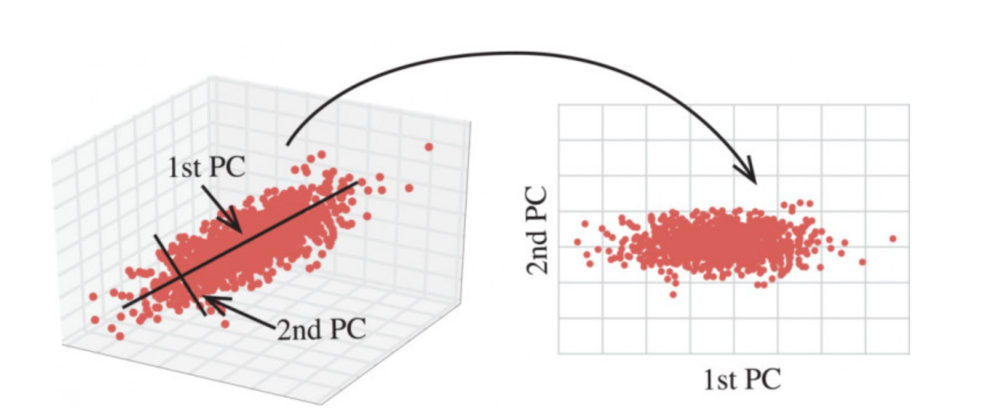

# 特征降维 

降维是指在某些限定条件下，降低随机变量(特征)个数，得到⼀组“不相关”主变量的过程

降维的两种⽅式：
- 主成分分析（可以理解⼀种特征提取的⽅式）
- 特征选择

## 主成分分析（PCA）

- 什么是主成分分析(PCA)
    - 定义：⾼维数据转化为低维数据的过程，在此过程中可能会舍弃原有数据、创造新的变量
    - 作⽤：是数据维数压缩，尽可能降低原数据的维数（复杂度），损失少量信息。
    - 应⽤：回归分析或者聚类分析当中

### API 

- sklearn.decomposition.PCA(n_components=None)
    - 将数据分解为较低维数空间
    - n_components:
        - ⼩数：表示保留百分之多少的信息
        - 整数：减少到多少特征
    - PCA.fit_transform(X) X:numpy array格式的数据[n_samples,n_features]
    - 返回值：转换后指定维度的array 

## 特征选择 

定义： 数据中包含冗余或⽆关变量（或称特征、属性、指标等），旨在从原有特征中找出主要特征。

### 方法 

Filter(过滤式)：主要探究特征本身特点、特征与特征和⽬标值之间关联
- ⽅差选择法：低⽅差特征过滤
- 相关系数
  
Embedded (嵌⼊式)：算法⾃动选择特征（特征与⽬标值之间的关联）
- 决策树:信息熵、信息增益
- 正则化：L1、L2
- 深度学习：卷积等

### 低⽅差特征过滤

删除低⽅差的⼀些特征，结合⽅差的⼤⼩来考虑这个⽅式的⻆度。
- 特征⽅差⼩：某个特征⼤多样本的值⽐较相近
- 特征⽅差⼤：某个特征很多样本的值都有差别 

#### API 

sklearn.feature_selection.VarianceThreshold(threshold = 0.0)
- 删除所有低⽅差特征
- Variance.fit_transform(X)
    - X:numpy array格式的数据[n_samples,n_features]
    - 返回值：训练集差异低于threshold的特征将被删除。默认值是保留所有⾮零⽅差特征，即删除所有样本中具有相同值的特征。

### 相关系数 

主要实现⽅式：
- ⽪尔逊相关系数
- 斯⽪尔曼相关系数

#### ⽪尔逊相关系数(Pearson Correlation Coefficient) 

- 作⽤：反映变量之间相关关系密切程度的统计指标
- 公式： 

$$
r = \frac{n \sum xy - \sum x \sum y}{\sqrt{n \sum x^2 - (\sum x)^2} \sqrt{n \sum y^2 - (\sum y)^2}}
$$

- 特点：
    - 相关系数的值介于–1与+1之间，即–1≤ r ≤+1。其性质如下：
        - 当r>0时，表示两变量正相关，r<0时，两变量为负相关
        - 当|r|=1时，表示两变量为完全相关，当r=0时，表示两变量间⽆相关关系
        - 当0<|r|<1时，表示两变量存在⼀定程度的相关。且|r|越接近1，两变量间线性关系越密切；|r|越接近于0，表示两变量的线性相关越弱
        - ⼀般可按三级划分：|r|<0.4为低度相关；0.4≤|r|<0.7为显著性相关；0.7≤|r|<1为⾼度线性相关

- API 
    - from scipy.stats import pearsonr
        - x : (N,) array_like
        - y : (N,) array_like Returns: (Pearson’s correlation coefficient, p-value)

#### 斯⽪尔曼相关系数(Rank IC)

- 作用：反映变量之间相关关系密切程度的统计指标
- 公式： 

$$
RankIC = 1 - \frac{6\sum d_{i}^2}{n(n^2 -1)}
$$
> n为等级个数，d为⼆列成对变量的等级差数 

- 特点
    - 斯⽪尔曼相关系数表明 X (⾃变量) 和 Y (因变量)的相关⽅向。 如果当X增加时， Y 趋向于增加, 斯⽪尔曼相关系数则为正
    - 与之前的⽪尔逊相关系数⼤⼩性质⼀样，取值 [-1, 1]之间 

## 小结 

- 降维的定义
    - 就是改变特征值，选择哪列保留，哪列删除
    - ⽬标是得到⼀组”不相关“的主变量

- 降维的两种⽅式
    - 特征选择
    - 主成分分析（可以理解⼀种特征提取的⽅式）
  
- 特征选择
    - 定义：提出数据中的冗余变量
    - ⽅法：
        - Filter(过滤式)：主要探究特征本身特点、特征与特征和⽬标值之间关联
            - ⽅差选择法：低⽅差特征过滤
            - 相关系数
        - Embedded (嵌⼊式)：算法⾃动选择特征（特征与⽬标值之间的关联）
            - 决策树:信息熵、信息增益
            - 正则化：L1、L2

- 低⽅差特征过滤
    - 把⽅差⽐较⼩的某⼀列进⾏剔除
    - api:sklearn.feature_selection.VarianceThreshold(threshold = 0.0)
        - 删除所有低⽅差特征
        - 注意，参数threshold⼀定要进⾏值的指定

- 相关系数
    - 主要实现⽅式：
        - ⽪尔逊相关系数
        - 斯⽪尔曼相关系数
    - ⽪尔逊相关系数
        - 通过具体值的⼤⼩进⾏计算
        - 相对复杂
        - api:from scipy.stats import pearsonr
            - 返回值，越接近|1|，相关性越强；越接近0，相关性越弱
    - 斯⽪尔曼相关系数
        - 通过等级差进⾏计算
        - ⽐上⼀个简单
        - api:from scipy.stats import spearmanr
            - 返回值，越接近|1|，相关性越强；越接近0，相关性越弱
- pca
    - 定义：⾼维数据转换为低维数据，然后产⽣了新的变量
    - api:sklearn.decomposition.PCA(n_components=None)
        - n_components
        - 整数 -- 表示降低到⼏维
        - ⼩数 -- 保留百分之多少的信息